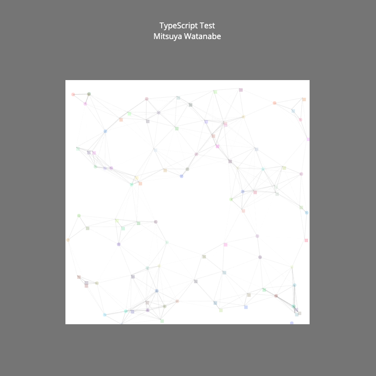

# Environment

### Build Version

I did not use vue-cli to setup project. Instead, I installed all dependencies and constructed build environment manually.

| Package    | Version |
| ---------- | :------ |
| typescript | v4.0.2  |
| webpack    | v4.44.1 |

# How to Build

### Install

NOTE: Your node version requires at least v12.

```
npm run install
```

### Build (Production Only)

The following command generates all assets into **dist** folder. You can test this application by opening the created **index.html** file with an arbitrary browser.

```
npm run build
```

### Development

The following command runs a local server for development. You can test this application by accessing **http://0.0.0.0:8080/** file with an arbitrary browser. If your laptop is running the other application on the port **8080**, change the port defined in **package.json** at script.serve property with a specific port. You can test the application on a smartphone, if the smartphone is on the same network with your laptop. In that case, input the internal IP on your laptop and the port to the search box on the smartphone. You can also test this application via a mobile browser in iOS simulator, which is provided by Xcode. In the development mode, test user and game data has already exists.

```
npm run serve
```
